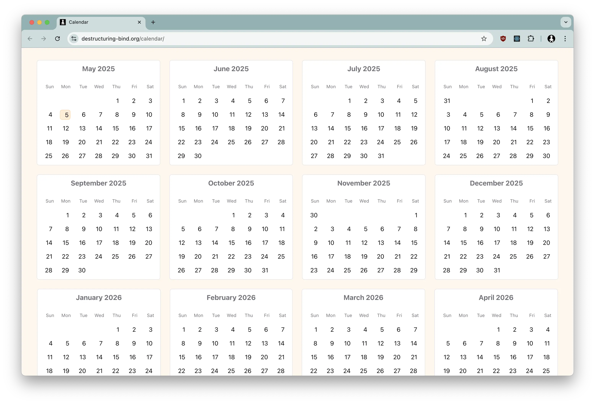

# Calendar

A small Typescript / React / Vite SPA that displays a yearly calendar:

- When invoked with the index page (https://www.destructuring-bind.org/calendar) it will show the next 12 months.
- When the year is appended in the URL (https://www.destructuring-bind.org/calendar/2025), it shows the given year starting from January.

The calendar is locale-aware and will display months and days in the users preferred locale. The current date will be highlighted:



Each calendar cell is clickable and will retrieve events for the selected day from Wikimedia:


The yearly calendar can be printed, and should format nicely on A4 in portrait or landscape mode:


## Running locally

```
yarn install
yarn dev
```
